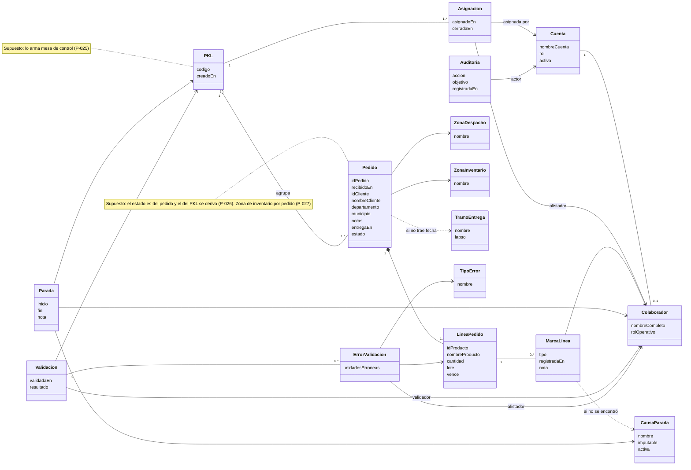

# Dicegsa — Arquitectura

## Modelo de dominio

| Entidad | Qué es | Notas |
|---|---|---|
| `Cuenta` | Credencial de acceso: nombre de cuenta, hash de contraseña, rol, estado. | Sin correo. Creada y reseteada solo por administrador. Roles: operario, mesa de control, supervisor, gerencia, admin. |
| `Colaborador` | Persona que opera en el piso. | Ligado a una `Cuenta`. Rol operativo: alistador o validador. |
| `Auditoria` | Quién hizo qué, sobre qué y cuándo. | Toda acción deja rastro — [D-028](../decisiones/POR-ACLARAR.md). Hoy cubre las acciones sobre cuentas. |
| `Pedido` | Lo que compra un cliente, tal como llega del ERP. | Id de pedido, fecha y hora, cliente, departamento, municipio, notas de televentas, fecha de entrega. Mesa de control le asigna zona de despacho y zona de inventario, y puede cambiarle la fecha de entrega — [D-037](../decisiones/POR-ACLARAR.md). |
| `LineaPedido` | Un producto distinto del pedido. | Id y nombre de producto, cantidad, lote y vencimiento, tal como vienen. Sin maestro de productos ni ubicaciones — [D-030](../decisiones/POR-ACLARAR.md). Unidad de conteo del Desempeño. |
| `PKL` | La orden de alisto: agrupa varios pedidos. | Unidad que se asigna y se trabaja. Un solo alistador asignado; sin terminar, sigue a su nombre — [D-031](../decisiones/POR-ACLARAR.md), [D-032](../decisiones/POR-ACLARAR.md). |
| `Asignacion` | Qué PKL tuvo cada alistador, quién se lo dio y cuándo. | Una reasignación cierra la anterior y abre otra; el historial por alistador sale de acá. |
| `ZonaDespacho` | A dónde va el pedido. | Catálogo configurable — [D-033](../decisiones/POR-ACLARAR.md). |
| `ZonaInventario` | Área del almacén de donde sale el pedido. | Catálogo configurable. Orienta a qué alistadores se asigna. |
| `TramoEntrega` | Plazo de entrega configurable. | Si el pedido no trae fecha de entrega, se calcula por tramo — [D-025](../decisiones/POR-ACLARAR.md). |
| `MarcaLinea` | Lo que el alistador marca sobre una línea. | Alistada, no encontrada, encontrada por inventario, dada de baja. Con hora del servidor — [D-026](../decisiones/POR-ACLARAR.md), [D-035](../decisiones/POR-ACLARAR.md). |
| `Parada` | Bloqueo con inicio, fin y causa. | Clasificada imputable / no imputable — esta bandera es la que decide si descuenta. |
| `CausaParada` | Catálogo tipificado de causas. | Configurable; nombre y clasificación no se editan — [D-021](../decisiones/POR-ACLARAR.md). |
| `Validacion` | La revisión del PKL entregado. | La hace el validador. Si encuentra errores, el PKL vuelve al mismo alistador — [D-036](../decisiones/POR-ACLARAR.md). |
| `ErrorValidacion` | Un error encontrado al validar. | Alistador, línea, unidades erróneas y tipo de error. Reemplaza la hoja firmada que hoy recibe el supervisor. |
| `TipoError` | Catálogo de tipos de error. | Configurable. Precargado con lo que revisa el validador: golpe, código de barras, lote, vencimiento, cantidad — [D-038](../decisiones/POR-ACLARAR.md). |
| `Estandar` | Rendimiento esperado por rol. | Configurable. Línea base vigente: 15 líneas/hora por alistador. |
| `CalculoOLE` | D, P, Q y el compuesto para un colaborador y período. | Derivado, reproducible desde los eventos. |

`CalculoOLE` no es una entidad de captura: es una proyección. Si se recalcula desde los eventos, debe dar lo mismo.

### Diagrama de clases

Los supuestos que todavía no confirmó CDF están anotados en el diagrama.

Estados de un PKL, derivados de sus pedidos: **sin asignar → en preparación → en validación → finalizado**, con vuelta de validación a preparación cuando hay errores.

## Flujos

**Alisto de un PKL**
Ver [D-032](../decisiones/POR-ACLARAR.md) y [D-036](../decisiones/POR-ACLARAR.md).

1. Televentas libera el pedido y llega a mesa de control, de a uno. Se carga en la plataforma con sus líneas y su fecha de entrega.
2. Mesa de control le asigna zona de despacho y zona de inventario, lo agrupa en un PKL y asigna el PKL a un alistador. Desde la asignación corre el cronómetro del servidor.
3. El alistador marca cada línea a medida que la arma. Solo él trabaja ese PKL; puede llevar varios a la vez.
4. Si no encuentra un producto, marca la línea como no encontrada y avisa a inventario. Si inventario no lo encuentra, televentas da de baja la línea o el pedido, y esa línea sale del conteo — [D-035](../decisiones/POR-ACLARAR.md).
5. Si se traba, registra la parada en un toque eligiendo la causa; el cronómetro de trabajo efectivo se detiene hasta que la cierra.
6. Si no termina en su horario, el PKL sigue a su nombre al día siguiente. Solo si la entrega está próxima, mesa de control lo reasigna.
7. Lo entrega al validador, que revisa los productos físicamente (golpes, código de barras, lote, vencimiento) y los empaca. Si hay errores, los registra y el PKL vuelve al mismo alistador para corregir; el supervisor ve el registro.
8. Validado, el PKL termina. Despacho y rutas quedan fuera de la plataforma.

**Cálculo de OLE**
Cerrado el turno, el motor recorre los eventos: D desde turno menos paradas no imputables, P desde líneas alistadas (sin las dadas de baja) contra `Estandar`, Q desde las validaciones. Resultado persistido con enlace a los eventos que lo componen.

**Alerta de pronta entrega**
Cada pedido lleva su fecha de entrega, que mesa de control puede adelantar o atrasar si el cliente lo pide. La vista de mesa de control ordena por tiempo restante, no por antigüedad, y marca en rojo los de pronta entrega. Un pedido de 15 minutos recién ingresado es más urgente que uno de 24 horas que lleva medio turno.

**Tiempo real**
Toda transición de estado y toda parada se emiten por WebSocket a las conexiones suscritas. El tablero de supervisión no hace polling.

El transporte es Socket.io sobre el mismo servidor HTTP de Fastify. La conexión se autentica con el JWT en el handshake y se rechaza si el token no verifica o si la contraseña sigue siendo la de un solo uso. Cada conexión entra a las salas que le corresponden por rol:

| Sala | Contenido | Quién |
|---|---|---|
| `tablero` | Transiciones del Kanban y paradas. | supervisor, gerencia, admin |
| `cuentas` | Altas, reseteos, cambios de rol y bajas. | admin |

El operario no se suscribe al tablero completo: recibe sus propias órdenes por petición, porque suscribirlo a todo le filtraría el desempeño de sus compañeros.

El reparto es en proceso. Una segunda instancia de API necesita el adaptador de Redis, porque cada proceso solo conoce sus propias conexiones — ver [D-006](../decisiones/POR-ACLARAR.md).

## Stack
Plataforma web reactiva, desacoplada y de alta concurrencia.

- **Runtime:** Bun. Ejecuta el backend y es el gestor de paquetes y el runner de tests.
- **Backend:** NestJS + TypeScript sobre adaptador **Fastify** (`@nestjs/platform-fastify`). Módulos por dominio con DI nativa, entrypoint en `src/main.ts`.
- **Persistencia:** PostgreSQL con **Drizzle ORM** (`drizzle-orm` + `drizzle-kit`). Esquema en TypeScript como fuente de verdad, migraciones generadas y versionadas.
- **Tiempo real:** WebSockets vía gateway de Nest sobre Fastify, para emisión de eventos instantáneos (tablero Kanban, cronometraje con latencia de ms).
- **Caché y fan-out:** Redis, **si aplica** — ver [D-006](../decisiones/POR-ACLARAR.md). Con una sola instancia de backend los eventos se reparten en proceso; Redis entra cuando haya más de una instancia o caché que lo justifique.
- **Auth:** nombre de cuenta + contraseña, JWT, guards por rol. Cuentas entregadas y recuperadas por administrador — ver abajo.
- **Frontend:** Next.js + TypeScript en modo **SPA** (`output: 'export'`, client-side rendering). Build estático servido por nginx. El alistador usa **la misma web en las computadoras compartidas del almacén**, con cambio rápido de usuario. Sin handheld ni app nativa — ver [D-020](../decisiones/POR-ACLARAR.md) y [D-039](../decisiones/POR-ACLARAR.md). Interfaces táctiles y de baja carga cognitiva. Iconos `lucide-react`, estilos TailwindCSS.
- **Infra:** VPS Linux de bajo consumo, publicado en una URL con HTTPS y acceso desde el navegador — ver [D-023](../decisiones/POR-ACLARAR.md). nginx sirve el estático del frontend, termina TLS y hace reverse proxy al API. Stack open source, sin licenciamiento privativo.

### Autenticación y ciclo de vida de cuentas ([D-005](../decisiones/POR-ACLARAR.md))
El operario de bodega no tiene correo corporativo. El correo no sirve ni como identificador ni como canal de recuperación, así que el modelo es cerrado y administrado:

- **Identificador:** nombre de cuenta, no correo. Único, sin distinción de mayúsculas.
- **Alta:** no hay auto-registro. El administrador crea la cuenta y entrega la credencial inicial.
- **Primer ingreso:** la contraseña entregada es de un solo uso — el sistema obliga a cambiarla antes de dar acceso a nada más.
- **Contraseña inicial:** la genera el sistema, aleatoria. Largo mínimo 8, sin reglas de composición: una política de escritorio en una computadora compartida termina en un papel pegado al equipo.
- **Recuperación:** no hay "olvidé mi contraseña" por correo, porque no hay correo. El administrador resetea y vuelve a entregar, y el ciclo de primer ingreso se repite.
- **Rastro:** toda alta, reseteo, cambio de rol y baja queda registrada con quién la hizo y cuándo. Si el admin puede tomar la identidad de cualquiera, el registro es lo único que lo hace auditable.
- **Baja:** las cuentas se desactivan, no se borran — sus eventos de alisto y sus cálculos de OLE tienen que seguir siendo trazables.

### Frontend SPA — decisión ([D-002](../decisiones/POR-ACLARAR.md))
App detrás de login (sin SEO), con datos en tiempo real por WebSocket. SSR no aporta: renderizaría estado viejo y rehidrataría. Se opta por SPA:

- **Render:** client-side. Next `output: 'export'` → HTML/JS/CSS estáticos.
- **Datos:** todo contra el API Nest (REST + WebSocket). Auth por JWT; sin route handlers ni middleware de Next.
- **Deploy:** archivos estáticos tras nginx. El VPS corre un solo proceso (el API en Bun); el frontend no suma un segundo.
- **Migración futura:** si aparece un portal público con SEO/SSR, se pasa a Next con server Node reusando el mismo código.

## Invariantes críticas
1. **Cero escrituras al ERP.** La plataforma lee órdenes y nunca toca la base transaccional corporativa (S-3.2).
2. **La interfaz de operario bloquea y reintenta ante corte de red.** Sin cola local: una cola local vuelve a meter el reloj del equipo en el cronometraje.
3. **El tiempo lo pone el servidor.** Las marcas de tiempo nunca vienen del reloj del equipo: relojes desajustados en bodega falsean el cronometraje.
4. **Toda parada tiene causa del catálogo.** No existe parada sin tipificar; sin causa no se puede decidir si descuenta.
5. **Solo las paradas no imputables descuentan de la Disponibilidad.** Es la invariante que sostiene toda la tesis de equidad.
6. **`OLE` es derivable.** Recalcular desde los eventos debe reproducir el valor almacenado; si no, el desglose auditable (REQ-013) es mentira.
7. **Los tres factores están acotados a [0, 1].** Un factor fuera de rango es un bug del modelo, no un desempeño excepcional.
8. **Un error de calidad nunca descuenta tiempo.** Entra por Q, por causa de origen, nunca como deducción al tiempo total (S-2.2).
9. **La contraseña solo se guarda hasheada.** Argon2id o bcrypt. Que el admin la entregue en mano no la vuelve un dato en claro.
10. **Toda acción deja rastro: quién, qué y cuándo.** Empezó por las acciones sobre cuentas, porque el admin puede resetear a cualquiera, y se extiende a órdenes, catálogos y configuración — ver [D-028](../decisiones/POR-ACLARAR.md).
12. **Ningún valor de negocio vive en el código.** Estándares, tramos, causas, ponderaciones y tipos de error se leen de configuración.
11. **Una cuenta nunca se borra.** Se desactiva, para no romper la trazabilidad de los eventos que produjo.
